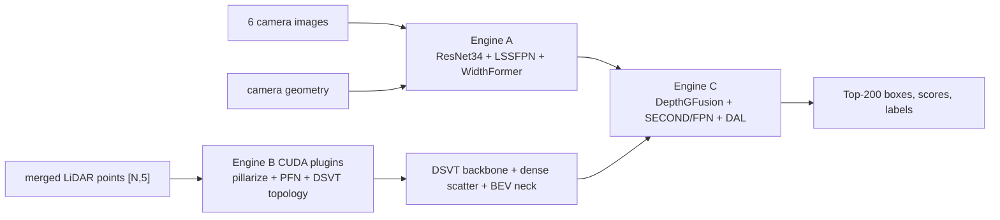

# DynamicBEVFusion deployment

[저장소](../README.md) · [모델 아키텍처](../new-arch.md) · [학습·checkpoint 전달](../tools/README.md) · [TensorRT 빌드](tensorrt/README.md) · [C++ 실행](runtime/README.md)

이 디렉터리는 현재 `DynamicBEVFusion` checkpoint를 ONNX artifact로 내보내고, Jetson AGX Thor에서 TensorRT engine 세 개를 빌드한 뒤 C++로 inference하기 위한 코드다. 기본 model config는 `configs/nuscenes/det/transfusion/secfpn/lidar/dsvt_dgf_dal_widthformer_0p3.yaml`이다.

기존 BEVFusion 학습 config는 이 저장소에 유지된다. 이 디렉터리의 exporter/builder/C++ runtime은 신규 모델의 아래 계약을 대상으로 하며 기존 NVIDIA native C++ runtime을 포함하지 않는다. `--config`는 학습 모델을 선택하지만 arbitrary architecture/camera count를 자동으로 동일 engine ABI에 맞추지는 않는다.

## Production architecture



Production TensorRT 공개 ABI는 다음과 같다.

| engine | 입력 | 출력 |
|---|---|---|
| Camera A | `images [1,6,3,256,704]`, `geometry [1,6,59,16,44,3]` | `camera_bev [1,80,180,180]` |
| LiDAR B | `points [N,5]`; 기본 config에서 runtime이 H2D 전에 `feature[4]`를 0으로 덮음 | `lidar_bev [1,256,180,180]`, `lidar_status [1]` |
| Fusion C | Camera/LiDAR BEV | `boxes [1,200,9]`, `scores [1,200]`, `labels [1,200]` |

Engine B 내부의 raw-point frontend는 ONNX로 표현하지 않는다. 대신 검증된 TensorRT IPluginV3 다섯 개와 native TensorRT PFN/position layers를 DSVT ONNX parts에 연결한다. 최종 Engine B는 PyTorch 없이 raw points를 직접 받는다.

## 디렉터리

| 경로 | 역할 |
|---|---|
| `onnx/export_all.py` | checkpoint에서 전체 배포 artifact 생성 |
| `onnx/export_camera_bev.py` | Camera A ONNX |
| `onnx/export_dsvt_bev.py` | standalone/hybrid DSVT 진단 ONNX |
| `onnx/export_lidar_trt_artifacts.py` | Production Engine B용 padded DSVT/neck ONNX와 frontend weights |
| `onnx/export_fusion_dal.py` | Fusion C ONNX |
| `onnx/model_contract.py` | model/config/checkpoint 계약과 manifest |
| `onnx/onnx_compat.py` | PyTorch 1.10 GridSample/atan2 ONNX 호환 |
| `onnx/resolve_config.py` | recursive YAML을 JSON으로 확인하는 진단 도구 |
| `tensorrt/build_all.py` | Thor에서 A/B/C engine bundle 생성 |
| `tensorrt/lidar_builder.py` | raw-point Engine B graph 조립 |
| `tensorrt/plugins/` | Engine B CUDA plugins와 CMake |
| `tensorrt/README.md` | Thor build 명령, capacity 및 ABI 명세 |
| `runtime/` | A/B 병렬 stream, Fusion event dependency, warmup·latency·memory를 제공하는 C++ inference |
| `runtime/run_inference.py` | engine·manifest·plugin hash와 model identity/profile 검증 후 C++ 실행 |
| `runtime/README.md` | Thor C++ build 및 실행 명령 |
| `runtime/evidence/` | 기존 Thor latency·메모리 원본 JSON, 신규 측정값이 아님 |
| `artifacts/.gitignore` | 대용량 생성물의 Git 유입 방지 |

## 학습 서버에서 export

먼저 실행 환경에 맞는 작업 경로를 선택한다. Host의 경로를 컨테이너 안에서 그대로 사용하지 않는다.

**기존 host venv:**

```bash
cd bevfusion  # 저장소 루트
source .venv/bin/activate
```

**학습 Docker 컨테이너:** [docker/README.md](../docker/README.md)의 image build/mount 절차로 들어온 뒤 실행한다. Python 환경은 이미 활성화되어 있으므로 `source`가 필요 없다.

```bash
cd /workspace/bevfusion
```

Checkpoint 경로는 **명령을 실행하는 환경에서 보이는 경로**를 사용한다.

| Checkpoint 위치 | 컨테이너에서 지정할 경로 |
|---|---|
| Host repository의 `runs/new-arch/epoch_20.pth` | 기본 `runs/` mount를 통해 `/workspace/bevfusion/runs/new-arch/epoch_20.pth` |
| Host의 별도 checkpoint 디렉터리 | 컨테이너 시작 시 `--mount type=bind,src=/absolute/host/checkpoints,dst=/checkpoints,readonly`를 `docker run` 옵션에 추가하고 `/checkpoints/model.pth` 사용 |

위 파일명은 경로 예시이며 해당 checkpoint가 저장소에 포함되어 있다는 뜻은 아니다. 별도 mount의 host 디렉터리는 먼저 존재해야 한다. 실제 파일을 아래 `--checkpoint`에 지정한다. 기본 mount에서는 export 결과가 host의 `deployment/artifacts/`에 남는다.

**선택한 환경에서 공통 export 명령:**

```bash
python deployment/onnx/export_all.py \
  --checkpoint /absolute/path/model.pth \
  --output-dir deployment/artifacts/onnx \
  --reference-dir deployment/artifacts/reference \
  --max-points 100000 \
  --max-pillars 10000 \
  --max-sets 512 \
  --pillars 5200 \
  --device cuda:0
```

세 capacity 값은 artifact/engine/plugin 사이의 계약이다. 위 값은 과거 Thor 검증값이며 production 센서 통계가 아니다. 1,000,000-point engine을 만들려면 `--max-points 1000000`으로 내보내고 Thor plugin과 engine profile도 같은 값으로 빌드해야 한다. `max_pillars`와 `max_sets`는 raw point 수로 자동 결정할 수 없으므로 별도로 확정한다.

Checkpoint가 없으면 production export를 거부한다. 현재 config와 구조가 일치하는 전체 checkpoint를 사용해야 한다. Exporter는 model 생성 전에 config의 외부 `Pretrained` 초기화를 비활성화하고 곧바로 지정한 PTH를 복원하므로 인터넷이나 별도 ResNet weight download가 필요 없다. 이전 PTH의 비학습 buffer `encoders.camera.vtransform.depth_values`가 있으면 현재 config 값과 일치하는지 확인한 뒤에만 제거하며, 그 밖의 누락·추가·shape 불일치는 strict load에서 실패한다.

변환 코드의 구조만 확인할 때는 `--allow-random-init`을 명시해야 하며 이 artifact는 production build에서도 기본적으로 거부된다.
CUDA를 사용할 수 없는 진단 환경에서는 `--device cpu --allow-cpu-only`로 export하며, manifest의 model provenance에 `export_device`와 `cpu_only: true`가 기록된다.

생성 구조:

```text
deployment/artifacts/onnx/
  camera_bev.onnx
  camera_bev.manifest.json
  fusion_dal.onnx
  fusion_dal.manifest.json
  lidar_trt/
    dsvt_padded_backbone.onnx
    dsvt_bev_neck.onnx
    lidar_frontend_weights.npz
    lidar_trt.manifest.json
```

Camera, Fusion 및 LiDAR manifest에는 동일한 config/checkpoint SHA-256이 기록된다. Thor의 `build_all.py`는 세 모델 identity가 다르면 빌드를 시작하지 않는다.

## ONNX 및 artifact 계약

### camera_bev.onnx

| tensor | dtype | shape |
|---|---|---|
| `images` | FP32 | `[1,6,3,256,704]` |
| `geometry` | FP32 | `[1,6,59,16,44,3]` |
| `camera_bev` | FP32 | `[1,80,180,180]` |

`geometry`는 calibration과 augmentation을 적용해 계산한 depth-bin별 LiDAR 좌표이며 실제 frame 값을 사용해야 한다.

### lidar_trt production artifact

| artifact | 내용 |
|---|---|
| `dsvt_padded_backbone.onnx` | fixed-capacity DSVT transformer |
| `dsvt_bev_neck.onnx` | dense `[1,128,360,360]`에서 LiDAR BEV 생성 |
| `lidar_frontend_weights.npz` | checkpoint의 PFN 및 position MLP weights |
| `lidar_trt.manifest.json` | capacity, ABI, artifact hash, checkpoint provenance |

Thor builder가 이 묶음에 CUDA plugins를 연결한 뒤 최종 입력은 `points FP32 [N,5]`가 된다. LiDAR manifest는 `official_layout`과 `zero_feature_channels`를 기록한다. 기본 nuScenes single-sweep 입력은 `x,y,z,intensity,ring_index`이며 runtime은 manifest의 `[4]`를 읽어 H2D 전에 `feature[4]`를 0으로 덮는다. 다른 sensor feature 계약을 사용하려면 학습 config와 manifest가 함께 일치해야 한다. 다섯 solid-state LiDAR는 상위 모듈에서 하나의 기준 좌표계와 timestamp로 정렬·병합되어 들어온다는 전제다.

`lidar_status=0`은 정상이다. 0이 아니면 pillar/set overflow이므로 출력 BEV를 폐기해야 한다. Profile 밖의 `N`은 enqueue 오류이며 입력을 조용히 자르지 않는다.

### dsvt_bev.onnx

이 파일은 topology를 외부에서 제공하는 standalone/hybrid 진단 graph다. 입력은 `src [P,128]`, 두 shift의 set index/mask/gather, position embedding과 `coords [P,4]`이다. Production raw-point Engine B는 이 파일을 사용하지 않고 `lidar_trt/` 묶음을 사용한다.

### fusion_dal.onnx

| tensor | dtype | shape |
|---|---|---|
| `camera_bev` | FP32 | `[1,80,180,180]` |
| `lidar_bev` | FP32 | `[1,256,180,180]` |
| `boxes` | FP32 | `[1,200,9]` |
| `scores` | FP32 | `[1,200]` |
| `labels` | INT32 | `[1,200]` |

Box 순서는 `x,y,z_bottom,dx,dy,dz,yaw,vx,vy`다. Threshold, 최종 정렬과 필요한 경우 NMS는 consumer 정책이다.

## 검증 상태

2026-09-07에 random-init 기준 Camera, standalone DSVT와 Fusion ONNX export 및 ONNX checker를 통과했다. 2026-09-09에는 학습 서버의 `2608_bevfusion` 환경에서 `bevfusion-e7ad28a7/runs/mini_fp32/epoch_20.pth`를 사용해 공식 `export_all.py` 경로 전체를 `1000 points / 64 pillars / 64 sets` 진단 capacity로 실행했다. 다음 항목이 통과했다.

- 외부 pretrained URL 접근 없는 model 생성 및 실제 PTH 전체 weight strict 일치
- Camera, padded DSVT backbone, LiDAR BEV neck와 Fusion ONNX 4개의 export 및 ONNX checker
- PFN/position weight 46개 NPZ 생성
- Camera/LiDAR/Fusion의 동일 config·checkpoint identity와 LiDAR artifact SHA-256 확인

과거 Thor TensorRT 10.13.2.6 환경에서는 legacy 구조와 기본 capacity `100000 points / 10000 pillars / 512 sets`의 raw-point Engine B 및 CUDA plugin 다섯 개가 검증됐다. 이 저장소는 그 구조를 현재 checkpoint/export manifest 흐름으로 패키징한다. Inference 동작 판단은 기존 Thor 실측을 사용하며 현재 공식 기본 구조는 Thor에서 재실측하지 않았다. 원본 수치와 측정 조건은 [runtime/README.md](runtime/README.md#검증-근거와-적용-범위)를 단일 기준으로 사용한다.

현재 repository의 C++ runtime은 과거 Thor 실행본에서 현재 engine 이름과 ABI로 migration했으며, 학습 서버에서 TensorRT 비의존 모듈의 `g++ -fsyntax-only -Wall -Wextra -Wpedantic` 검사를 통과했고, CLI smoke에서 `--points 1000000 --warmup 0`과 기본 plugin 5개 구성이 확인됐다. `runtime/run_inference.py`는 bundle hash·checkpoint identity·plugin·point profile과 LiDAR 구조 계약을 검사한 뒤 C++를 실행하며 CPU runtime/launcher 테스트 20개가 통과했다. 현재 실행 입력은 synthetic이며 실센서 연동이나 정확도 검증을 뜻하지 않는다.

현재 패키징 변경본의 Thor 재빌드·재실행 결과를 새로 기록한 것은 아니다. 새로운 checkpoint/config 또는 1,000,000-point capacity의 성능·정확도는 이전 측정에서 도출할 수 없으며 해당 구성 선택 시 확인한다. 팀이 결정할 입력 명세는 camera 수/순서, 통합 points의 feature 의미/좌표계/시간 기준, point·pillar·set 분포와 capacity, precision, consumer 후처리 정책이다.

Thor engine build의 정확한 명령은 [tensorrt/README.md](tensorrt/README.md), C++ 실행과 latency/memory 측정은 [runtime/README.md](runtime/README.md)를 따른다.
