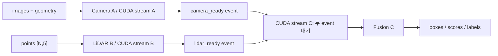

# C++ inference runtime

[저장소](../../README.md) · [배포/입출력 계약](../README.md) · [Thor engine 빌드](../tensorrt/README.md)

Camera A, raw-point LiDAR B, Fusion C engine을 초기화하고 warmup → inference → 출력 검사를 수행한다. 선택적으로 latency와 메모리를 측정한다. 실제 추론은 C++이며 PyTorch가 필요 없다. 기본 CLI 입력은 synthetic이다.

## 실행 구조



Camera/LiDAR는 서로 다른 host thread에서 `enqueueV3`를 제출한다. 세 CUDA stream은 non-blocking이며 Fusion은 두 branch 완료 event를 기다린다. A/B의 BEV 출력 allocation을 C가 직접 사용하므로 중간 복사가 없다.

| 파일 | 책임 |
|---|---|
| `main.cpp` | 옵션 → 초기화 → warmup → 추론 → 출력/측정 orchestration |
| `options.{hpp,cpp}` | CLI 파싱과 기본 경로 |
| `trt_components.{hpp,cpp}` | plugin 로딩, engine/context 소유, I/O ABI 검사 |
| `cuda_resources.{hpp,cpp}` | CUDA buffer/stream/event 수명, 통합 메모리 측정 |
| `multisensor_pipeline.{hpp,cpp}` | A/B/C 연결, branch 제출, 출력 검사, benchmark |
| `statistics.{hpp,cpp}`, `common.{hpp,cpp}` | percentile 통계, 공통 오류 처리 |
| `CMakeLists.txt` | C++17 executable `bevfusion_trt_infer` 빌드 |
| `run_inference.py` | bundle 무결성 확인 후 C++ 실행, Python 표준 라이브러리만 사용 |
| `tests/test_run_inference.py` | GPU 없는 bundle/launcher 계약 테스트 |
| `evidence/*.json` | 기존 Thor 실측 원본 보관 |

## 빌드와 실행

먼저 [TensorRT 빌드 절차](../tensorrt/README.md)로 A/B/C engine, build/bundle manifest, plugin 다섯 개를 준비한다. Thor Docker에는 C++17 compiler, CMake 3.18 이상, CUDA toolkit, TensorRT C++ headers/library가 있어야 한다.

```bash
cd /workspace/bevfusion
cmake -S deployment/runtime \
  -B deployment/artifacts/runtime-build \
  -DCMAKE_BUILD_TYPE=Release
cmake --build deployment/artifacts/runtime-build -j

python deployment/runtime/run_inference.py \
  --bundle deployment/artifacts/tensorrt/bundle_fp16.manifest.json \
  --warmup 20 --latency --iterations 100
```

메모리는 latency와 별도 실행에서 측정한다. Sampling 자체가 시간 측정에 영향을 줄 수 있다.

```bash
python deployment/runtime/run_inference.py \
  --bundle deployment/artifacts/tensorrt/bundle_fp16.manifest.json \
  --warmup 20 --memory --memory-sample-ms 2
```

## Bundle 검사와 경로

Launcher는 engine 세 개·build manifest 세 개·plugin 다섯 개의 SHA-256, 동일 config/checkpoint identity, precision, build 당시 TensorRT version/machine 일치와 LiDAR point profile/capacity를 검사한다. 오류가 있으면 C++나 plugin을 시작하지 않는다. 검증된 경로를 argv로 전달하고 C++의 종료 코드를 반환한다. 이 파일 검사 시간은 C++ initialization/추론 latency 밖에 있다.

```text
deployment/artifacts/tensorrt/
  bundle_fp16.manifest.json
  camera_bev_fp16.engine       + camera_bev_fp16.manifest.json
  dsvt_lidar_fp16.engine       + dsvt_lidar_fp16.manifest.json
  fusion_dal_fp16.engine       + fusion_dal_fp16.manifest.json
  plugins/
    libdynamic_pillar_decorate.so
    libdynamic_scatter_max.so
    libtensor_barrier.so
    libdsvt_rotated_set.so
    libdsvt_dense_scatter.so
```

Builder가 기록한 과거 절대 경로의 **파일명**을 현재 bundle 디렉터리에서 해석하고 hash를 검증한다. 전체 묶음의 mount 경로를 바꿀 수 있으며 PTH/ONNX는 실행 시 필요 없다. 검사·실행 중 bundle 파일을 변경하지 않는다. FP32 묶음은 `--bundle .../bundle_fp32.manifest.json`으로 선택한다.

```bash
python deployment/runtime/run_inference.py \
  --bundle deployment/artifacts/tensorrt/bundle_fp16.manifest.json \
  --check-only
```

`--check-only`는 GPU, TensorRT Python package, C++ executable 없이 파일 무결성만 검사하며 `check=artifact_integrity_only` JSON을 출력한다. 실제 engine deserialize/GPU 호환성 검사가 아니다. C++는 로드된 engine의 실제 이름·dtype·shape를 다시 검사한다.

## 옵션과 입력

| 옵션 | 동작 |
|---|---|
| `--bundle PATH` | launcher 필수 입력. engine/plugin 개별 override 대신 검증된 묶음 사용 |
| `--runtime PATH` | launcher에서 C++ executable 위치 지정 |
| `--check-only` | launcher 파일 검사만 수행 |
| `--allow-random-init` | launcher에서 진단용 random-init bundle을 명시적으로 허용 |
| `--points N` | synthetic point 수. launcher 기본값은 bundle `point-opt`; C++ 직접 실행 기본값은 34,688 |
| `--warmup N` | 기본 20, 0 허용 |
| `--latency --iterations N` | A/B/C 단독, 직렬·병렬 mean/P50/P90/P95/P99. 기본 100회 |
| `--memory` | startup/initialization/warmup/inference/shutdown 메모리 및 단계별 peak |
| `--memory-sample-ms N` | sampling 주기. `--memory`도 활성화, 기본 2 ms |
| `--profile` | warmup 후 단일 inference에 CUDA profiler start/stop 적용 |
| `--single-thread-submit` | A/B host 제출을 한 thread에서 하는 진단 모드 |
| `--synthetic-unique-pillars` | 360×360 grid로 occupied pillar를 늘리는 overflow 진단. 129,600개 이후 반복 |

C++ 직접 실행 시 `--camera-engine PATH`, `--lidar-engine PATH`, `--fusion-engine PATH`, `--plugin PATH`(다섯 번), `--parallel-submit`도 사용할 수 있다. 이 경로에는 bundle hash 검사가 없다. 기본 FP16 engine/plugin 경로는 **저장소 root 기준 상대 경로** `deployment/artifacts/tensorrt/`이며 다른 CWD에서는 명시적 경로나 launcher를 사용한다.

현재 engine 계약은 [배포 I/O 표](../README.md#onnx-및-artifact-계약)를 따른다. CLI의 image/geometry는 zero-filled이고 point는 기본 80×80 XY grid 반복이다. 실센서 파일 입력·프레임 갱신 API와 전체 detection 저장 인터페이스는 아직 제공하지 않는다. `N`의 실제 허용 범위는 Engine B profile이며 조용히 입력을 자르지 않는다.

`lidar_status != 0`이면 결과를 폐기하고 오류로 종료한다. 현재 status 검사는 Fusion 완료 후 CPU에서 읽는 방식이다. GPU에서 overflow를 감지해 Fusion enqueue 자체를 생략하는 구조는 아니다. 출력 검사는 boxes finite, scores 0..1, labels 0..9를 확인하며 정확도 비교를 대신하지 않는다.

시간 범위: model GPU 실행과 engine 내부 DAL decode를 포함한다. Engine B 내부 pillar/PFN/topology도 포함된다. 외부 센서 전처리, 입력 생성·H2D, engine deserialize, 출력 D2H/검사는 제외하며 initialization/warmup wall time을 별도로 출력한다.

## 메모리 지표

Thor의 CPU와 GPU는 물리 메모리를 공유한다. 아래 지표를 함께 사용하고 서로 더해 모델 실사용량으로 보고하지 않는다.

| 출력 | 의미 |
|---|---|
| `system_used`, `system_available`, `system_used_percent` | `MemTotal - MemAvailable` 기준 시스템 전체 사용 압력/여유량. 모델 단독 사용량 아님 |
| `system_reclaimable_cache_estimate` | `Buffers + Cached + SReclaimable - Shmem`, 회수 가능 cache 추정 |
| `cuda_memgetinfo_free_raw`, `cuda_memgetinfo_nonfree_raw` | CUDA allocator 관점. 모델 점유율 또는 물리 사용률로 해석하지 않음 |
| `cuda_memgetinfo_nonfree_delta_from_startup` | startup 대비 CUDA raw 값 변화 |
| `process_rss`, `process_hwm` | 프로세스 resident memory 및 high-water mark |
| `persistent_io` | runtime이 할당한 I/O buffer bytes 합계 |
| `trt_context_requirement` | 세 engine context device-memory 요구량 합계 |
| `tracked_total` | persistent I/O + context 요구량. plugin/driver의 모든 allocation을 포함하지 않음 |
| `peak_system_used`, `min_system_available`, `peak_cuda_memgetinfo_nonfree_raw`, `peak_process_rss` | 선택한 sampling 주기에 관측한 단계별 극값 |

## 검증 근거와 적용 범위

2026-09-10 결정: **inference 실행 구조의 정상 동작은 기존 Thor 실측을 근거로 판단한다.** 현재 작업은 저장소·문서 정리이며 재접속/재실측을 완료 조건으로 두지 않는다. 현재 패키징 변경본을 Thor에서 새로 실행했다는 주장은 하지 않는다.

### 기존 Thor 실측

조건: Jetson AGX Thor, `depthfusion:thor-trt-v3`, CUDA 13 / TensorRT 10.13.2.x, FP16 engine, random-init 및 34,688 synthetic points. 기본 capacity는 100,000 points / 10,000 pillars / 512 sets다.

| 2026-09-03, 100회 측정 | ms |
|---|---|
| Camera A 단독 P50 | 4.9916 |
| LiDAR B 단독 P50 | 12.5970 |
| Fusion C 단독 P50 | 8.7866 |
| 직렬 전체 P50 | 26.3831 |
| 병렬 전체 P50 | 26.4405 |
| 병렬 전체 P99 | 27.3075 |

원본: [CUDA overlap/latency JSON](evidence/thor_20260903_cuda_overlap_analysis.json). Nsight Systems의 A/B overlap은 약 10.3 ms다. 실제 병렬 실행은 확인됐고 직렬 대비 속도 개선은 없었다. 이 조건의 측정값은 35 ms 이내이며 제품 입력에 대한 성능 보장은 아니다.

별도 2026-09-04 memory run: persistent I/O 57.43 MiB, TRT context 요구량 681.69 MiB, tracked 합계 739.12 MiB, inference RSS 447.80 MiB. 시스템 전체 used 17,208.71 MiB는 모델 단독 메모리가 아니다. 원본: [통합 메모리 JSON](evidence/thor_20260904_cpp_runtime_memory_corrected.json). 이 JSON의 20회 clean latency는 위 100회 측정과 별도 실행이다.

두 JSON은 이전 저장소 `swmai-bevfusion-e7ad28a7f781/deploy/thor/results/`에서 내용 변경 없이 옮긴 근거 사본이다. 내부 command/경로는 측정 당시 기록이며 현재 실행 명령은 이 문서의 빌드/실행 절차를 사용한다.

### 현재 저장소 검사와 남은 제품 결정

C++의 TensorRT 비의존 모듈 구문·경고 검사와 100만 point CLI 파싱을 확인했다. Bundle launcher CPU 테스트 18개는 손상·혼합·profile 범위·실행 차단·종료 코드 전달을 검증한다. fixture bytes를 사용한 테스트이므로 GPU 실행 테스트가 아니다.

```bash
python -m unittest discover -s deployment/runtime/tests -v
```

현재 `deployment/`는 신규 6-camera A/B/C ABI의 smoke/benchmark runtime이다. 실센서 입력 연동, 학습 checkpoint 정확도, camera 수·BEV 크기 변경, 100만 point의 pillar/set capacity 및 성능·메모리는 별도로 결정한다. 100만 point는 CLI/profile로 표현 가능한 후보이며 기존 실측에서 검증한 point 수가 아니다.
