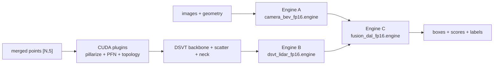

# TensorRT engine build for Jetson AGX Thor

[저장소](../../README.md) · [배포/입출력 계약](../README.md) · [C++ 실행/기존 실측](../runtime/README.md)

이 디렉터리는 `deployment/onnx`가 생성한 학습 artifact를 Jetson AGX Thor용 TensorRT engine 세 개로 빌드한다. Production Engine B는 raw point `[N,5]`를 직접 입력받으며 PyTorch 연산을 요구하지 않는다.

## 최종 engine 경계



모식도의 파일명은 아래 `--precision fp16` 빌드 기준이다. `fp32`를 선택하면 세 파일의 접미사도 `_fp32.engine`으로 바뀐다.

| engine | 입력 | 출력 |
|---|---|---|
| Camera A | `images FP32 [1,6,3,256,704]`, `geometry FP32 [1,6,59,16,44,3]` | `camera_bev [1,80,180,180]` |
| LiDAR B | `points FP32 [N,5]` | `lidar_bev [1,256,180,180]`, `lidar_status INT32 [1]` |
| Fusion C | `camera_bev [1,80,180,180]`, `lidar_bev [1,256,180,180]` | `boxes [1,200,9]`, `scores [1,200]`, `labels [1,200]` |

`lidar_status=0`만 유효하다. 값이 0이 아니면 pillar 또는 DSVT set capacity overflow이므로 해당 frame의 `lidar_bev`를 사용하면 안 된다. `N`이 TensorRT point profile 밖이면 enqueue 자체를 거부해야 한다.

## 소스 구성

| 파일 | 역할 |
|---|---|
| `builder.py` | Camera/Fusion ONNX parser, engine build 및 manifest |
| `lidar_builder.py` | raw points frontend와 learned LiDAR graph를 단일 Engine B로 조립 |
| `build_engine.py` | 일반 ONNX engine 한 개를 빌드하는 진입점 |
| `build_lidar_engine.py` | raw-point Engine B 전용 진입점 |
| `build_all.py` | A → raw-point B → C 세 engine과 bundle manifest 생성 |
| `plugins/CMakeLists.txt` | Thor CUDA plugin 5개와 capacity compile option |
| `plugins/*.cu` | pillar decorate, scatter-max, barrier, rotated-set, dense scatter |

DSVT transformer와 BEV neck의 학습 weight는 ONNX에 있고, PFN 및 position MLP weight는 `lidar_frontend_weights.npz`에 있다. TensorRT builder는 NPZ weight로 native TensorRT layer를 만들고 CUDA plugins와 연결한다. 따라서 Thor의 engine build 단계에는 PTH와 PyTorch 모델 로딩이 필요 없다.

## 기존 검증과 현재 변경의 구분

기존 Thor 검증은 다음 조건이었다.

```text
Target: Jetson AGX Thor, compute capability 11.0
Docker: depthfusion:thor-trt-v3
TensorRT: 10.13.2.6
CUDA: 13.0
Capacity: max_points=100000, max_pillars=10000, max_sets=512
Engine B ABI: points -> lidar_bev + lidar_status
```

이 디렉터리의 기본 plugin capacity도 기존 검증값을 유지한다. Inference 실행 구조는 기존 Thor 실측을 기준으로 판단한다. 현재 정리 작업은 재실측 없이 진행하며 측정 원본은 [runtime/evidence](../runtime/evidence/)에 보관한다. CMake 옵션으로 1,000,000 points 등 다른 capacity를 만들 수 있지만, 변경된 구성의 메모리·latency·정확도는 기존 실측의 보장 범위가 아니다.

## Thor Docker prerequisite

`depthfusion:thor-trt-v3`는 기존 Thor 실측에서 사용한 **로컬 이미지 태그**다. 공개 registry의 다운로드 주소가 아니며 `docker pull`만으로 확보할 수 있다고 가정하지 않는다. 이 저장소의 `docker/Dockerfile`은 x86_64 학습용으로, 이 Thor 이미지를 재구성하지 않는다.

### 이미지 확인·전달

이미지를 보유한 Thor host에서 먼저 확인한다.

```bash
docker image inspect depthfusion:thor-trt-v3 \
  --format 'id={{.Id}} os={{.Os}} arch={{.Architecture}}'
```

Image ID와 `linux/arm64`를 확인·기록한다. 이미지를 다른 Thor에 전달해야 한다면, 보유 host의 repository root에서 다음 파일을 만든다. 이미지 archive는 클 수 있으므로 생성·전달·load 전에 양쪽 디스크 여유 공간을 확인한다.

```bash
mkdir -p deployment/artifacts/image-transfer
docker image save --output deployment/artifacts/image-transfer/depthfusion-thor-trt-v3.tar \
  depthfusion:thor-trt-v3
cd deployment/artifacts/image-transfer
sha256sum depthfusion-thor-trt-v3.tar > depthfusion-thor-trt-v3.tar.sha256
```

두 파일을 팀에서 승인한 전달 경로로 대상 Thor에 옮긴다. 대상 host에서 두 파일이 있는 디렉터리로 이동한 후 검사하고 로드한다. 같은 태그의 다른 이미지가 있으면 ID를 기록하고 보존 여부를 결정한 뒤 진행한다.

```bash
sha256sum -c depthfusion-thor-trt-v3.tar.sha256 && \
  docker image load --input depthfusion-thor-trt-v3.tar
docker image inspect depthfusion:thor-trt-v3 \
  --format 'id={{.Id}} os={{.Os}} arch={{.Architecture}}'
```

송신·수신 image ID가 같은지 확인한다. 이 절차는 이미지 전달 방법이며 이번 문서 갱신에서 실제 save/load를 수행한 것은 아니다. Archive에는 host에 mount했던 repository·ONNX·engine·dataset이 포함되지 않는다. 별도 source/artifact 전달과 대상 Thor의 NVIDIA driver/Container Runtime 준비가 필요하다.

**이미지 또는 archive를 확보할 수 없다면:** 현재 저장소에는 Thor image용 Dockerfile, base image digest, 전체 package lock이 없으므로 동일 환경의 재구성은 아직 제공하지 않는다. 이미지 관리자로부터 검증 이미지나 원본 Dockerfile·설치 기록을 확보해야 한다. CUDA 13/TensorRT 10.13.2.6이라는 버전 정보만으로 임의 이미지를 동일 검증 환경이라고 간주하지 않는다.

### 컨테이너 실행과 환경 확인

Thor host의 repository와 export artifact를 container에 같은 mount로 제공한다.

```bash
docker run --rm -it \
  --runtime nvidia \
  --ipc host \
  -v /home/armstrong/workspace/bevfusion:/workspace/bevfusion \
  -w /workspace/bevfusion \
  depthfusion:thor-trt-v3 bash
```

Container에는 TensorRT Python/C++ library, CUDA toolkit, CMake, ONNX와 NumPy가 있어야 한다.

```bash
python -c "import tensorrt, onnx, numpy; print(tensorrt.__version__)"
nvcc --version
cmake --version
```

PTH는 학습 서버에서만 사용한다. Thor에는 `deployment/artifacts/onnx` 전체와 현재 source tree를 전달하면 된다. TensorRT engine은 target GPU/TensorRT/CUDA/plugin ABI에 종속되므로 다른 장치에서 생성한 plan을 Thor production artifact로 사용하지 않는다.

학습 서버 exporter는 config의 외부 `Pretrained` 초기화를 비활성화한 뒤 지정한 전체 PTH를 복원한다. 따라서 PTH export에는 인터넷이나 별도 backbone download가 필요 없다. 이전 PTH의 비학습 buffer `encoders.camera.vtransform.depth_values`만 config 값과 동일할 때 migration하며, 다른 누락·추가·shape 불일치는 strict load에서 실패한다.

## 1. 학습 서버: PTH에서 배포 artifact 생성

현재 config와 일치하는 checkpoint를 사용한다. Capacity는 engine artifact의 일부이므로 명시적으로 지정한다. 아래 예시는 host venv 기준이다. 학습 Docker에서는 [export 환경·checkpoint 경로](../README.md#학습-서버에서-export)를 따라 `/workspace/bevfusion`에서 실행하고 `source`를 생략한다.

```bash
cd /home/culee/workspace/bevfusion
source /home/culee/2608_bevfusion/bin/activate

python deployment/onnx/export_all.py \
  --checkpoint /absolute/path/model.pth \
  --output-dir deployment/artifacts/onnx \
  --max-points 100000 \
  --max-pillars 10000 \
  --max-sets 512 \
  --pillars 5200 \
  --device cuda:0
```

`--pillars`는 ONNX trace용 example pillar 수다. 실제 runtime limit은 `--max-points`, `--max-pillars`, `--max-sets`가 결정한다.

생성물:

```text
deployment/artifacts/onnx/
  camera_bev.onnx
  camera_bev.manifest.json
  fusion_dal.onnx
  fusion_dal.manifest.json
  lidar_trt/
    dsvt_padded_backbone.onnx
    dsvt_bev_neck.onnx
    lidar_frontend_weights.npz
    lidar_trt.manifest.json
```

Standalone `dsvt_bev.onnx`가 필요하면 `export_dsvt_bev.py`를 별도로 실행한다. Production Engine B는 `lidar_trt/` 묶음을 사용한다.

## 2. Thor: CUDA plugins 빌드

ONNX export 때 지정한 capacity와 동일한 값으로 plugin을 컴파일한다.

```bash
cmake -S deployment/tensorrt/plugins \
  -B deployment/artifacts/plugin-build \
  -DCMAKE_BUILD_TYPE=Release \
  -DTHOR_CUDA_ARCHITECTURES=110 \
  -DDYNAMIC_BEVFUSION_MAX_POINTS=100000 \
  -DDYNAMIC_BEVFUSION_MAX_PILLARS=10000 \
  -DDYNAMIC_BEVFUSION_MAX_SETS=512 \
  -DCMAKE_INSTALL_PREFIX=deployment/artifacts/tensorrt/plugins

cmake --build deployment/artifacts/plugin-build -j
cmake --install deployment/artifacts/plugin-build
```

생성되는 libraries:

```text
libdynamic_pillar_decorate.so
libdynamic_scatter_max.so
libtensor_barrier.so
libdsvt_rotated_set.so
libdsvt_dense_scatter.so
```

Builder는 plugin 출력 shape와 ONNX artifact capacity가 다르면 engine build 전에 실패한다. Point profile 최대값이 plugin의 compile-time 최대값보다 크면 TensorRT plugin shape validation 단계에서 실패한다.

## 3. Thor: 세 engine 생성

```bash
python deployment/tensorrt/build_all.py \
  --onnx-dir deployment/artifacts/onnx \
  --plugin-dir deployment/artifacts/tensorrt/plugins \
  --engine-dir deployment/artifacts/tensorrt \
  --point-min 1 \
  --point-opt 34688 \
  --point-max 100000 \
  --precision fp16 \
  --workspace-gib 4 \
  --optimization-level 3 \
  --max-aux-streams 0
```

`point-opt=34688`은 이전 nuScenes mini 검증 frame 값일 뿐 production 고정값이 아니다. 실제 통합 LiDAR 분포를 기준으로 다시 정한다. `point-max`는 export/plugin의 `max_points`보다 클 수 없다.

생성물:

```text
deployment/artifacts/tensorrt/
  camera_bev_fp16.engine
  camera_bev_fp16.manifest.json
  dsvt_lidar_fp16.engine
  dsvt_lidar_fp16.manifest.json
  fusion_dal_fp16.engine
  fusion_dal_fp16.manifest.json
  bundle_fp16.manifest.json
  timing.cache
```

세 export artifact의 config/checkpoint SHA-256이 다르거나 random-init artifact이면 production build를 거부한다. 각 build manifest에는 engine/ONNX/plugin hash, TensorRT 버전, precision, workspace, point profile, internal capacity, public ABI와 context device-memory 요구량을 기록한다.

## 1,000,000 points profile

코드는 `max_points=1000000`을 받을 수 있게 구성되어 있다. 이 경우 세 단계의 값이 모두 같아야 한다.

```text
ONNX export:  --max-points 1000000
Plugin CMake: -DDYNAMIC_BEVFUSION_MAX_POINTS=1000000
Engine build: --point-max 1000000
```

그러나 raw point가 1,000,000개라는 사실만으로 `max_pillars`와 `max_sets`가 정해지지는 않는다. 현재 grid의 이론상 pillar 상한은 129,600이고 set 상한은 1,690이지만, 이 값을 그대로 사용하면 padded DSVT tensor와 attention 비용이 크게 증가한다. 실제 데이터의 최대/상위 percentile, overflow 정책 및 35 ms 목표를 기준으로 capacity를 확정해야 한다. 입력을 조용히 자르는 동작은 코드에 넣지 않았다.

## 단일 Engine B만 빌드

Engine을 다른 디렉터리나 장치로 옮길 때는 build manifest에 기록된 SHA-256과 동일한 plugin `.so` 다섯 개를 함께 배포해야 한다. 같은 plugin 이름/version으로 capacity만 다르게 재컴파일한 library를 기존 engine과 섞으면 안 된다.

```bash
python deployment/tensorrt/build_lidar_engine.py \
  --artifact-dir deployment/artifacts/onnx/lidar_trt \
  --plugin-dir deployment/artifacts/tensorrt/plugins \
  --output deployment/artifacts/tensorrt/dsvt_lidar_fp16.engine \
  --point-min 1 \
  --point-opt 34688 \
  --point-max 100000 \
  --precision fp16
```

## 4. Thor: C++ inference runtime

Engine 세 개와 plugin 설치가 끝나면 runtime을 빌드한다.

```bash
cmake -S deployment/runtime \
  -B deployment/artifacts/runtime-build \
  -DCMAKE_BUILD_TYPE=Release
cmake --build deployment/artifacts/runtime-build -j

python deployment/runtime/run_inference.py \
  --bundle deployment/artifacts/tensorrt/bundle_fp16.manifest.json \
  --warmup 20 --latency --iterations 100
```

Runtime은 Camera와 LiDAR를 별도 non-blocking CUDA stream 및 host submit thread에서 시작하고, 두 CUDA event가 완료된 뒤 Fusion stream을 실행한다. 상세 옵션과 memory 지표 정의는 [runtime/README.md](../runtime/README.md)를 따른다.

Launcher는 현재 bundle의 engine/build-manifest/plugin SHA-256, config/checkpoint identity, precision 및 point profile을 확인한 뒤 C++를 실행한다. `--points` 미지정 시 bundle `point-opt`를 사용한다. GPU 없이 파일 무결성만 검사하려면 `--check-only`를 추가한다. Bundle 이동 시 engine과 build manifest는 bundle 파일 옆에, plugin은 `plugins/` 하위에 함께 둔다. 검사 통과는 실제 TensorRT deserialize 또는 inference 성공을 보장하지 않는다.

## PASS의 의미

Builder가 `PASS`를 출력하려면 다음 조건을 만족해야 한다.

1. artifact SHA-256 및 동일 checkpoint 검증
2. CUDA plugin 5개 로드와 creator 등록
3. raw frontend, DSVT backbone, dense scatter와 neck 연결
4. 공개 ABI가 `points -> lidar_bev + lidar_status`인지 확인
5. TensorRT serialized engine 생성
6. deserialize, execution context 생성 및 opt shape 출력 계약 확인
7. build/bundle manifest 기록

2026-09-09 학습 서버 재점검에서는 `bevfusion-e7ad28a7/runs/mini_fp32/epoch_20.pth`를 strict load하고 공식 `export_all.py` 전체를 작은 진단 capacity(`1000/64/64`)로 실행했다. Camera/DSVT/neck/Fusion ONNX 4개의 checker, NPZ weight 46개, 세 branch의 동일 model identity, LiDAR artifact hash와 오프라인 model load가 통과했다.

ONNX export와 현재 bundle 검사/launcher CPU 테스트 18개는 각각 변환 및 파일 계약의 검증이다. C++ inference 실행 구조의 근거는 기존 Thor 실측을 사용한다. 현재 패키징 변경본을 재측정했다는 뜻은 아니며, 새로운 weight/capacity의 성능·정확도 확인은 해당 구성의 배포 검증에 속한다. 실측 수치·메모리 해석은 [runtime/README.md](../runtime/README.md#검증-근거와-적용-범위)를 따른다.
