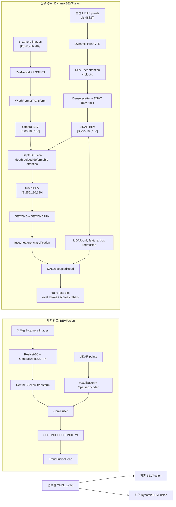

# BEVFusion 신규 아키텍처

[저장소 시작 페이지](README.md) · [배포 계약](deployment/README.md) · [C++ 실행/기존 실측](deployment/runtime/README.md)

## 1. 목적과 선택 방법

이 브랜치는 별도 학습 프로젝트를 만들지 않고 기존 `configs/`, `mmdet3d/`, `tools/` 구조에 신규 모델을 추가한다. 기존 BEVFusion 코드는 그대로 선택할 수 있으며 모델 종류와 카메라 수는 일반 config 파일로 결정한다.

| 용도 | 실행 config | 모델 | 카메라 |
|---|---|---|---|
| 팀 기존 구성 | `configs/nuscenes/det/transfusion/secfpn/camera+lidar/resnet50/convfuser.yaml` | `BEVFusion` | 전방 3대 |
| 기존 BEVFusion 6-camera 구성 | `configs/nuscenes/det/transfusion/secfpn/camera+lidar/resnet50/convfuser_6cam.yaml` | `BEVFusion` | nuScenes 6대 |
| 신규 구성 | `configs/nuscenes/det/transfusion/secfpn/lidar/dsvt_dgf_dal_widthformer_0p3.yaml` | `DynamicBEVFusion` | nuScenes 6대 |

`configs/nuscenes/default.yaml`의 기본값은 팀의 기존 3-camera 동작을 보존한다. 6-camera config는 `camera_names`만 명시적으로 재정의한다. `NuScenesDataset`이 더 이상 카메라 세 대를 소스에 하드코딩하지 않으므로 config를 복사해 카메라 조합을 변경할 수 있다.

## 2. 아키텍처



신규 모델은 기존 `BEVFusion`을 상속하고 config로 선택한 WidthFormer camera encoder, DSVT LiDAR encoder, `DepthGFusion`, `DALDecoupledHead`를 조립한다. DAL 아이디어에 따라 fused feature는 분류에, LiDAR-only feature는 box regression에 사용한다. 신규 학습 구현은 PyTorch 모듈이며 기존 CUDA ops를 재사용한다. TensorRT 배포 시 사용하는 다섯 CUDA plugin은 `deployment/tensorrt/plugins/`에 별도로 있다.

## 3. 추가·변경 파일

### 신규 모델 파일

| 파일 | registry 이름과 역할 |
|---|---|
| `mmdet3d/models/backbones/dsvt.py` | `DSVTLidarEncoder` registry adapter |
| `mmdet3d/models/backbones/dsvt_core.py` | raw point batch → dynamic pillar → DSVT → LiDAR BEV |
| `mmdet3d/models/vtransforms/widthformer.py` | `WidthFormerTransform`; calibration-aware camera BEV |
| `mmdet3d/models/fusers/depth_guided_attention.py` | depth-guided deformable cross-attention |
| `mmdet3d/models/fusers/depth_gfusion.py` | `DepthGFusion`; camera/LiDAR BEV 결합 |
| `mmdet3d/models/heads/bbox/dal_decoupled.py` | `DALDecoupledHead`; 분류/회귀 feature decoupling |
| `mmdet3d/models/fusion_models/dsvt_bevfusion.py` | 기존 BEVFusion에서 raw-point DSVT encoder만 교체 |
| `mmdet3d/models/fusion_models/dynamic_bevfusion.py` | `DynamicBEVFusion`; 전체 신규 경로 조립 |
| `mmdet3d/models/utils/bev_grid.py` | BEV 크기·축 순서 검증 |

각 패키지의 `__init__.py`에는 위 registry 모듈 import만 추가했다.

### Config·dataset·검증 파일

| 파일 | 변경 내용 |
|---|---|
| `configs/nuscenes/default.yaml` | 기본 3-camera 목록 및 train/val/test dataset 전달 |
| `configs/nuscenes/det/transfusion/secfpn/camera+lidar/resnet50/convfuser_6cam.yaml` | 기존 BEVFusion의 6-camera 선택 config |
| `configs/nuscenes/det/transfusion/secfpn/lidar/dsvt_dgf_dal_widthformer_0p3.yaml` | 신규 아키텍처 전체 config |
| `mmdet3d/datasets/nuscenes_dataset.py` | `camera_names` 지원, 3-camera 하드코딩 제거, intrinsic key 호환 |
| `mmdet3d/models/fusion_models/bevfusion.py` | non-depth transform도 호출 가능하도록 `depths=None` 기본값 추가 |
| `tools/smoke_train.py` | 표준 config로 실제 mini batch의 forward/backward/optimizer 검증 |
| `tools/train.py` | 기존 Torchpack 학습 진입점 |
| `tools/train_torchrun.py` | 기존 train.py를 torchrun으로 호출하는 현재 환경용 wrapper |

## 4. 신규 모델 입출력 계약

`DynamicBEVFusion.forward()`의 주요 입력은 다음과 같다.

| 이름 | 형식 | 의미 |
|---|---|---|
| `img` | `FloatTensor[B,N,3,256,704]` | 개별 카메라 영상. 현재 신규 config의 `N=6` |
| `points` | 길이 `B`의 list, 원소 `FloatTensor[Ni,5]` | 통합 LiDAR point cloud. 현재 nuScenes loader가 선택한 5개 column을 그대로 사용 |
| `camera2ego`, `lidar2camera`, `lidar2image`, `camera2lidar` | `FloatTensor[B,N,4,4]` | 카메라별 calibration transform |
| `lidar2ego` | `FloatTensor[B,4,4]` | LiDAR-to-ego transform |
| `camera_intrinsics` | `FloatTensor[B,N,4,4]` | camera intrinsic matrix |
| `img_aug_matrix`, `lidar_aug_matrix` | `FloatTensor[B,N,4,4]`, `FloatTensor[B,4,4]` 중심 | 학습 augmentation transform |
| `metas` | batch metadata | bbox decoding에 필요한 sample metadata |
| `gt_bboxes_3d`, `gt_labels_3d` | batch list | 학습 target |

학습 모드 출력은 `loss/object/*`와 `stats/object/*` key를 가진 dict다. 평가 모드 출력은 sample별 `boxes_3d`, `scores_3d`, `labels_3d` dict다.

신규 PyTorch DSVT 입력의 `Ni`는 고정 shape가 아니며 batch마다 달라도 된다. 다섯 대 solid-state LiDAR의 좌표계와 timestamp가 상위 모듈에서 하나의 ego/LiDAR 기준으로 정렬·병합되어 들어온다는 전제다. 현재 구현에는 10,000-point 같은 임의 절단은 없다. 다만 1,000,000 points의 학습·추론 메모리와 latency는 아직 실측하지 않았으므로 지원 완료로 간주하지 않는다. TensorRT의 고정 capacity와 35 ms 추론 목표도 이 PyTorch 학습 smoke의 검증 범위가 아니다.

## 5. 환경과 실행

준비된 학습 서버 venv는 Python 3.8 / PyTorch 1.10.1+cu113 / MMCV-full 1.4.0 / MMDetection 2.20.0 / Torchpack 0.3.1 / nuScenes-devkit 1.1.11 / ONNX 1.14.1이다. 이를 기준으로 `docker/Dockerfile`과 고정 requirements에 x86_64 학습 환경을 정리했다. 이미지 빌드 중 Python 개발 header와 CUDA compiler를 설치하고 기존 extension 12개를 컴파일한다. OpenCV/YAPF/protobuf 호환 버전, mount와 컨테이너 학습 명령은 [docker/README.md](docker/README.md)를 따른다. 이 Dockerfile은 Thor runtime용이 아니며 실제 image build/컨테이너 학습 검증은 아직 수행하지 않았다.

```bash
cd /home/culee/workspace/bevfusion
source /home/culee/2608_bevfusion/bin/activate

# 현재 import 대상 확인
python -c "import mmdet3d; print(mmdet3d.__file__)"

# 신규 아키텍처 실제 1-step smoke
python tools/smoke_train.py \
  configs/nuscenes/det/transfusion/secfpn/lidar/dsvt_dgf_dal_widthformer_0p3.yaml \
  --dataroot /home/culee/nuscenes_mini --device 0

# 전체 학습: 기존 train.py를 현재 torchrun 환경에서 호출
python -m torch.distributed.run --nproc_per_node=1 tools/train_torchrun.py \
  configs/nuscenes/det/transfusion/secfpn/lidar/dsvt_dgf_dal_widthformer_0p3.yaml \
  --run-dir runs/new-arch
```

전체 학습의 기본 dataset root는 `data/nuscenes/`다. 로컬 mini directory를 이 위치에 제공하거나 config의 `dataset_root`를 설정한다. `samples/`, `sweeps/`, `nuscenes_infos_train.pkl`, `nuscenes_infos_val.pkl`을 준비한다. 기존 config의 `ObjectPaste` 사용 시 `nuscenes_dbinfos_train.pkl`과 GT database도 필요하다. 신규 config는 ObjectPaste를 사용하지 않는다. 기존 파일/링크가 있을 때 덮어쓰지 않는다.

OpenMPI/mpi4py가 준비된 기존 환경에서는 `torchpack dist-run -np 1 python tools/train.py <config> --run-dir <directory>`도 유지한다. config를 변경하면 기존 3/6-camera 모델도 같은 학습 진입점을 사용한다.

mini map-expansion 파일이 없는 환경에서 기존 detection config만 smoke할 때는 `tools/smoke_train.py ... --object-only`를 사용한다. 이는 detection 입력과 loss를 유지하고 map segmentation label loader만 제외한다.

## 6. 2026-09-07 검증 결과

- PASS: Python 문법 검사.
- PASS: venv의 `mmdet3d`가 `/home/culee/workspace/bevfusion/mmdet3d`를 가리킴.
- PASS: 기존 CUDA extension 12개 빌드 및 신규 registry 5종 등록.
- PASS: 3-camera BEVFusion, 6-camera BEVFusion, 6-camera DynamicBEVFusion config 모두 recursive resolve.
- PASS: 신규 DynamicBEVFusion의 실제 nuScenes-mini 1-step 학습.
  - 입력: 6 views, 32,250 points, 15 boxes
  - 모델 파라미터: 44,521,340
  - 실행: forward, backward, optimizer step
  - gradient parameter 수: camera 190, LiDAR 194, fusion 54, head 42
  - peak CUDA allocated: 4.612 GiB

## 7. 참고 구현

- DSVT: <https://github.com/Haiyang-W/DSVT>
- WidthFormer: <https://github.com/ChenhongyiYang/WidthFormer>
- DepthFusion DGF: <https://github.com/Mingqj/DepthFusion>
- DAL head: <https://github.com/HuangJunJie2017/BEVDet/blob/dev3.0/mmdet3d/models/dense_heads/dal_head.py>

전체 외부 저장소를 복제하지 않았으며, 현재 BEVFusion 인터페이스에 필요한 아이디어와 연산 경계만 옮겼다.

## 8. ONNX 및 Thor TensorRT 배포

학습 모델과 TensorRT 배포는 같은 checkpoint를 사용하지만 실행 경계가 다르다.

```text
PyTorch training/eval
  List(Tensor[Ni,5]) -> DynamicBEVFusion -> loss 또는 detection

Production TensorRT
  Engine A: images + geometry -> camera_bev
  Engine B: merged points [N,5] -> lidar_bev + lidar_status
  Engine C: camera_bev + lidar_bev -> boxes + scores + labels
```

| 단계 | 실제 진입 파일 | 실행 위치 |
|---|---|---|
| PTH → 배포 artifact | `deployment/onnx/export_all.py` | 학습 서버 `2608_bevfusion` 환경 |
| Engine B plugin compile | `deployment/tensorrt/plugins/CMakeLists.txt` | Jetson AGX Thor Docker |
| A/B/C engine build | `deployment/tensorrt/build_all.py` | Jetson AGX Thor Docker |
| C++ engine inference | `deployment/runtime/main.cpp` | Jetson AGX Thor Docker |
| Bundle 검증 후 C++ 실행 | `deployment/runtime/run_inference.py` | 무결성 검사는 CPU 가능, 추론은 Thor Docker |
| 전체 계약과 파일 명세 | `deployment/README.md` | 공통 |
| Thor 명령과 capacity 명세 | `deployment/tensorrt/README.md` | 공통 |
| C++ runtime 옵션과 측정 명세 | `deployment/runtime/README.md` | 공통 |

Production Engine B는 CUDA plugin 다섯 개를 사용해 dynamic pillar, PFN scatter, DSVT topology와 dense scatter를 engine 내부에서 수행한다. 공개 입력은 `points FP32 [N,5]`, 출력은 `lidar_bev [1,256,180,180]`와 `lidar_status INT32 [1]`이다. 따라서 배포 runtime에 PyTorch VFE/InputLayer를 남기지 않는다.

기존 Thor 검증 capacity는 `100000 points / 10000 pillars / 512 sets`다. 소스는 최대 point 수를 포함한 capacity를 CMake 옵션으로 변경할 수 있지만, 1,000,000-point 설정은 아직 성능·메모리·정확도 검증 전이다. 자세한 생성 명령과 artifact 이름은 `deployment/README.md`와 `deployment/tensorrt/README.md`를 단일 기준으로 사용한다.

C++ runtime은 `deployment/runtime/`에 있으며 initialization, configurable warmup, 단일 inference, 출력 검사와 선택적 latency/memory 측정을 제공한다. Camera와 LiDAR는 별도 CUDA stream에서 제출되고 Fusion은 두 완료 event를 기다린다. `run_inference.py --bundle ...`는 engine·manifest·plugin SHA-256, model identity와 point profile을 검사한 뒤 C++를 실행한다. 현재 입력은 synthetic이며 실센서 연동은 미구현이다. CPU launcher 테스트 18개는 통과했다. Inference 동작 판단은 기존 Thor 실측을 기준으로 하며, 현재 정리 작업에서 재실측을 완료 조건으로 두지 않는다. [실행/실측 문서](deployment/runtime/README.md)에 근거와 적용 범위를 함께 유지한다.

현재 A/B/C exporter·builder·runtime은 신규 모델의 명시된 6-camera ABI 전용이다. 기존 BEVFusion PyTorch config 보존과 기존 NVIDIA native C++ 배포 지원은 별개이며, 후자는 이 `deployment/`에 구현되어 있지 않다. camera 수·BEV 크기·head output이 달라지는 config는 export 계약과 runtime ABI도 함께 맞춰야 한다.
